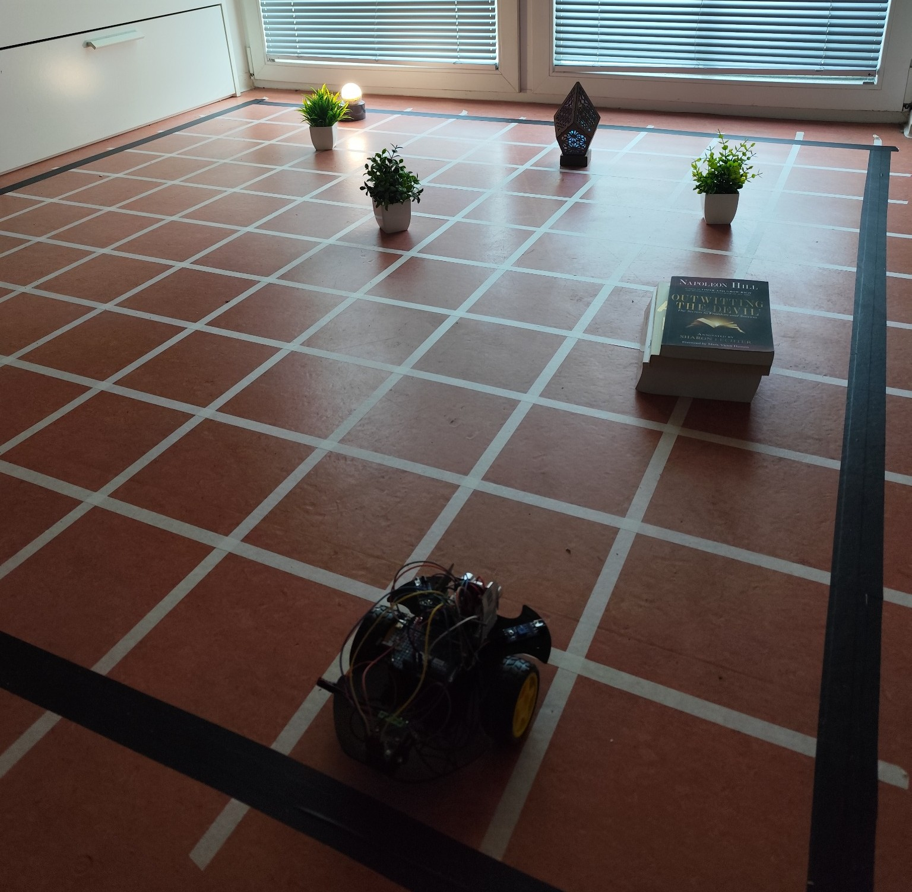
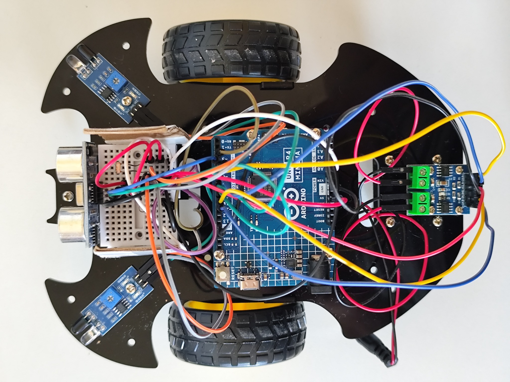
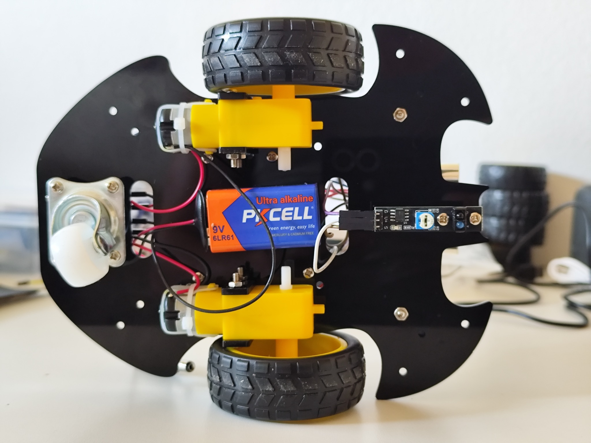
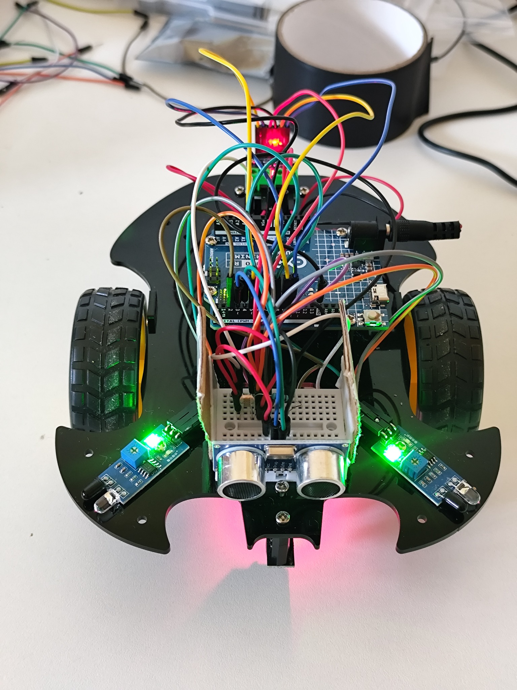
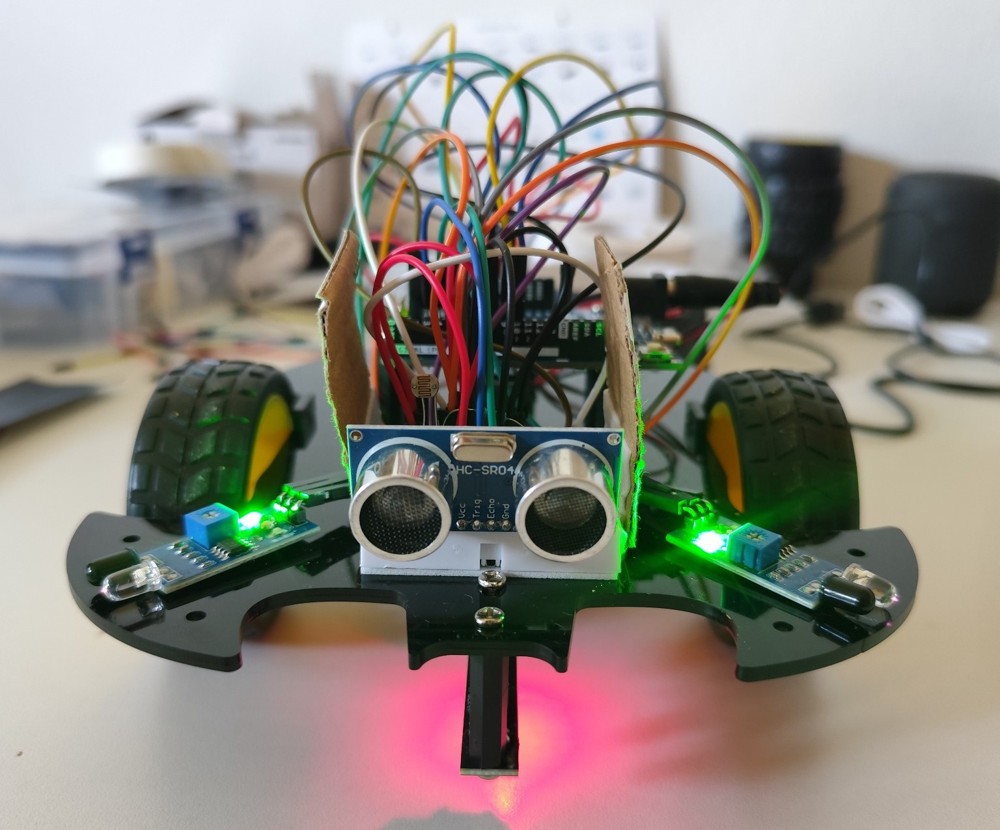
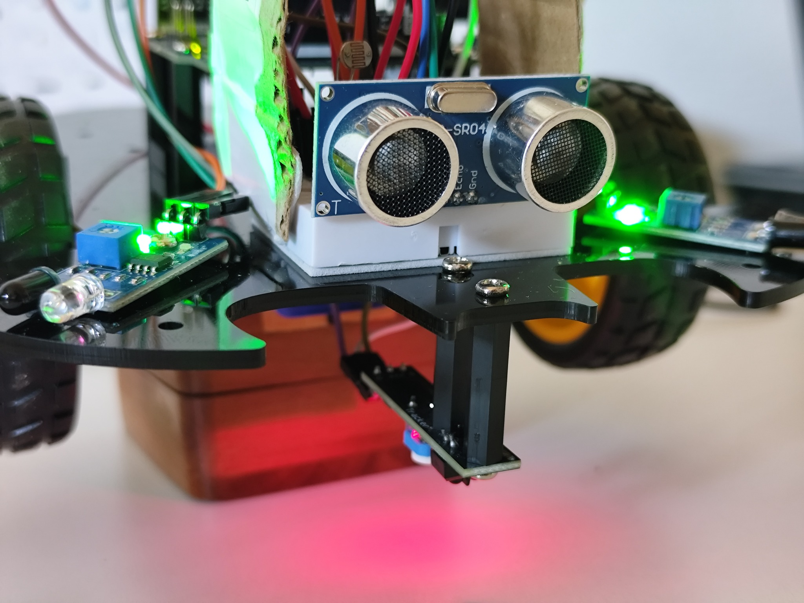
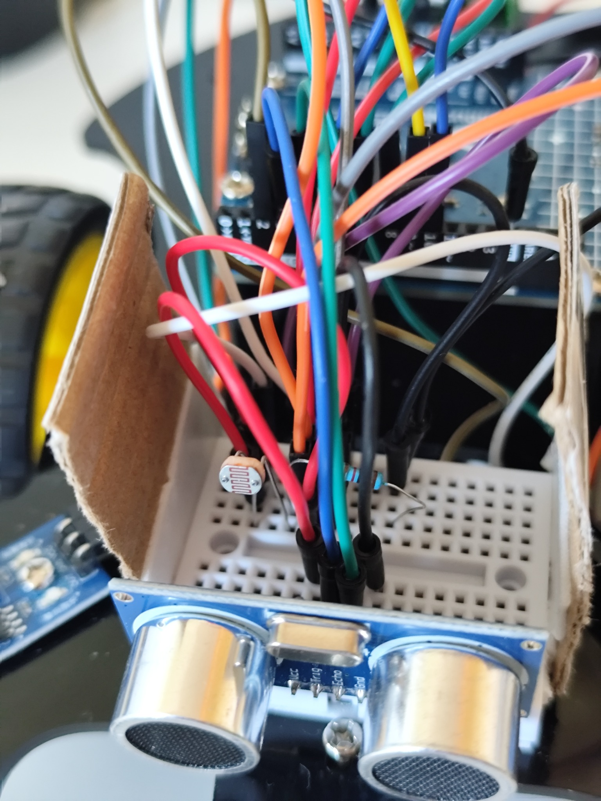
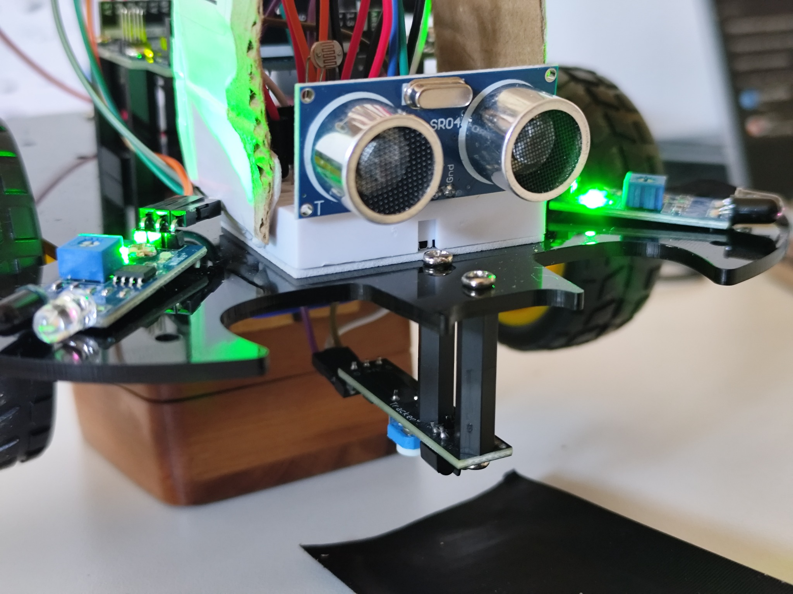
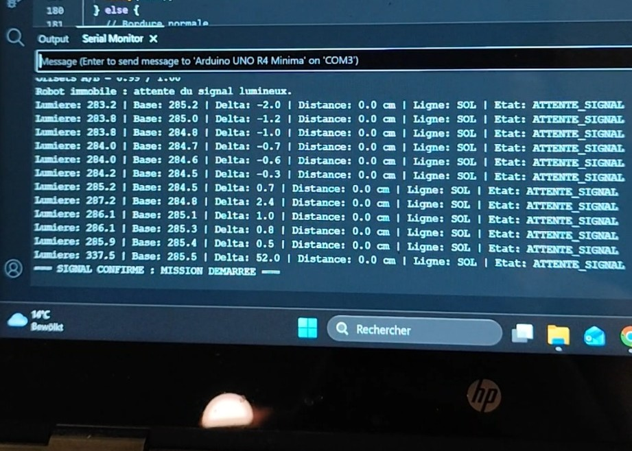
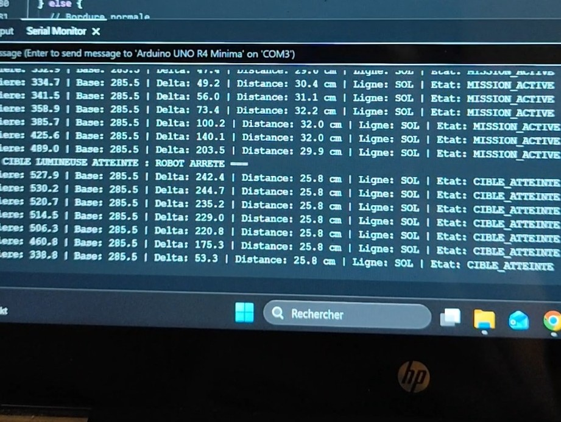

# Implementation Draft I-0.9 - Physical Hardware Diagnostics and Calibration

| Field | Value |
|---|---|
| Status | Validated |
| Date | 2026-09-27 |
| Repository branch | `implementation/i-0.9` |

## 1. Objective

I-0.9 prepares the transition from the deterministic simulation delivered by
I-0.8 to the physical AI-Logistics-Robot platform.

Its purpose is to assemble the first complete hardware prototype, validate each
electronic component independently, calibrate the motors and sensors, and
record reproducible physical observations before the final V1 integration.

The current prototype can:

- start a physical mission after detecting an increased light signal;
- move autonomously using two independently controlled TT motors;
- detect lateral obstacles with two infrared sensors;
- estimate frontal obstacle distance with an HC-SR04 ultrasonic sensor;
- detect the black boundary surrounding the physical grid;
- perform reduced-speed recovery manoeuvres near obstacles and boundaries;
- stop near an illuminated target by combining light and distance information.

These behaviours are experimental hardware diagnostics. They do not yet
constitute the final physical V1 integration.

## 2. Scope Boundary

I-0.9 includes:

- chassis assembly and component mounting;
- Arduino UNO R4 Minima setup and firmware upload;
- motor-driver wiring and individual motor tests;
- motor replacement, direction correction, and speed calibration;
- infrared obstacle-sensor calibration;
- ultrasonic distance-sensor validation;
- black-boundary detection with a line-tracking sensor;
- photoresistor wiring with a 10 kOhm voltage-divider resistor;
- adaptive ambient-light baseline experiments;
- combined light, obstacle, boundary, and movement experiments;
- documentation of successful tests and remaining limitations.

I-0.9 does not modify the validated I-0.8 software core. It also does not claim
final camera perception, wireless robot control, physical path planning, or
complete end-to-end V1 integration. Those capabilities remain assigned to
I-1.0.

## 3. Next Integration Step - Overhead ESP32-CAM

The next planned hardware step is to install an ESP32-CAM at a fixed elevated
position outside the robot. The camera will be angled downward and configured
to observe the complete physical grid from a global viewpoint.

The ESP32-CAM will not be mounted on the robot. A fixed overhead viewpoint
avoids camera motion, provides a stable reference frame, and makes it possible
to observe the robot, grid boundaries, target areas, and obstacles together.

Its planned responsibilities are:

- capture and transmit images of the physical grid over Wi-Fi;
- support calibration between image coordinates and grid coordinates;
- support estimation of the robot position and orientation;
- support detection of target zones and relevant obstacles;
- provide physical observations to a future perception adapter.

This camera layer is important because it will connect the physical experiment
to the software architecture validated in I-0.8. The future vision component
will translate camera observations into data accepted through the existing
`Perception` boundary. The I-0.8 Brain, Planning, Control, and Memory components
will remain responsible for mission decisions.

The ESP32-CAM is therefore a global observation device, not the decision
engine. The Arduino remains responsible for low-level motor actuation and
immediate local sensor reactions, while the I-0.8 software core remains the
high-level decision foundation.

## 4. Physical Prototype Inventory

The I-0.9 prototype uses:

- one Arduino UNO R4 Minima;
- one two-wheel acrylic robot chassis;
- two 3-6 V TT geared DC motors;
- two 65 mm wheels and one rear caster wheel;
- one L9110S-compatible dual DC motor-driver module;
- two infrared obstacle-detection modules;
- one HC-SR04 ultrasonic distance sensor;
- one single-channel line-tracking sensor;
- one photoresistor;
- one 10 kOhm resistor for the photoresistor voltage divider;
- one mini breadboard;
- jumper wires and shared 5 V and GND distribution groups;
- one independent mobile power source;
- a physical test grid with a black external boundary;
- movable obstacles and a continuously illuminated target lamp.

The grid used for the current experiments is approximately 2 m by 2 m. Thin
internal lines provide a visible coordinate reference for documentation, while
the thicker black external tape is used by the line-tracking sensor as a safety
boundary.

## 5. Arduino Pin Assignment

| Component or function | Firmware symbol | Arduino pin | Purpose |
|---|---:|---:|---|
| Line-tracking sensor signal | `lineSensor` | D2 | Detect the black external boundary |
| HC-SR04 trigger | `trigPin` | D3 | Start an ultrasonic measurement |
| HC-SR04 echo | `echoPin` | D4 | Receive the ultrasonic return pulse |
| Motor-driver channel A input 1 | `A_1B` | D5 | Motor direction and PWM control |
| Motor-driver channel A input 2 | `A_1A` | D6 | Motor direction and PWM control |
| Right infrared sensor | `rightIR` | D7 | Detect a local obstacle on the right |
| Left infrared sensor | `leftIR` | D8 | Detect a local obstacle on the left |
| Motor-driver channel B input 1 | `B_1B` | D9 | Motor direction and PWM control |
| Motor-driver channel B input 2 | `B_1A` | D10 | Motor direction and PWM control |
| Photoresistor divider output | `LDR_PIN` | A0 | Measure the target-light intensity |
| Shared supply distribution | — | 5 V | Supply the low-voltage sensor groups |
| Shared electrical reference | — | GND | Establish a common ground |

The breadboard is used only as a distribution and voltage-divider support.
Every module shares the same electrical ground. The ESP32-CAM is not connected
to these pins during I-0.9 and is not powered from this prototype circuit.

## 6. Hardware Validation Results

| Test | Observed result | Status |
|---|---|---|
| Arduino compilation and upload | The firmware compiled and uploaded successfully to the Arduino UNO R4 Minima. | Passed |
| Individual motor directions | Both motors operated forward and backward under direct test commands. | Passed |
| Straight movement calibration | EEPROM-based motor offsets and runtime PWM correction produced acceptable straight movement on the test surface. | Passed with calibration |
| Infrared sensor independence | Each sensor reacted independently to a nearby obstacle. | Passed |
| Combined infrared detection | When both infrared sensors detected obstacles, both wheels entered the configured backward response. | Passed |
| Ultrasonic measurement | The HC-SR04 produced distance values that changed consistently with obstacle position and was observed up to approximately 90 cm. | Passed |
| Frontal obstacle avoidance | A frontal obstacle below 20 cm triggered a short backward and turning manoeuvre. | Passed |
| Black-boundary detection | The line sensor reported the red floor as LOW and the black tape as HIGH. | Passed |
| Normal boundary recovery | The robot stopped, moved backward briefly, and turned back toward the grid. | Passed |
| Corner recovery | A second boundary detection within 2.5 seconds triggered the reinforced corner manoeuvre. | Passed with experimental tuning |
| Photoresistor divider | The photoresistor and 10 kOhm voltage divider produced variable analog readings instead of a permanent maximum value. | Passed |
| Light-triggered mission | A sustained increase above the ambient-light baseline started the mission. | Passed in controlled lighting |
| Illuminated-target arrival | The robot stopped only when the light increase and ultrasonic target-distance conditions were confirmed together. | Passed in controlled lighting |
| Combined autonomous experiment | The robot moved, avoided representative obstacles, reacted to the grid boundary, and stopped near the illuminated target. | Passed as a prototype experiment |

The motion behaviour was evaluated on the physical grid and during free-floor
obstacle experiments. Representative obstacles included walls, table legs,
books, and movable objects.

## 7. Current Experimental Settings

### 7.1 Light detection

| Setting | Current value |
|---|---:|
| Light-signal activation delta | `30` analog units |
| Target-arrival light delta | `220` analog units |
| Target-arrival distance | `25 cm` or less |
| Averaged samples per light reading | `10` |
| Consecutive confirmations | `5` |
| Slow pre-mission baseline adaptation | Enabled |
| Baseline adaptation during a mission | Disabled |

The ambient-light baseline is calibrated while the target lamp is off. It may
adapt slowly before mission activation, but it remains fixed during the active
mission so that approaching the lamp is measured against one stable reference.

### 7.2 Motion and recovery

| Situation | Backward command | Turning command | Timing |
|---|---:|---:|---|
| Normal black boundary | `130` | `backLeft(120)` | 250 ms backward, 220 ms turn |
| Repeated boundary or probable corner | `140` | `backLeft(120)` | 300 ms backward, 350 ms turn |
| Frontal ultrasonic obstacle below 20 cm | `140` | `backLeft(120)` | 250 ms backward, 220 ms turn |
| Both infrared sensors active | `140` | — | Maintained while detected |
| Left infrared sensor active | — | `backLeft(120)` | Maintained while detected |
| Right infrared sensor active | — | `backRight(120)` | Maintained while detected |
| Free forward movement | — | — | `moveForward(120)` |

A repeated boundary detection is classified as a probable corner when it occurs
within 2.5 seconds of the preceding boundary event.

The motor correction values are read from EEPROM at startup. They remain
specific to this physical robot, its motors, its wheels, the battery condition,
and the test surface.

## 8. Known Limitations

- The photoresistor measures light intensity but not the direction of the light.
- Direct daylight from the window can shift the ambient baseline or resemble
  the target signal.
- The current light thresholds are most reliable during controlled evening
  tests with repeatable room lighting.
- The two infrared sensors provide only local binary obstacle information and
  cannot determine global obstacle coordinates.
- The single forward ultrasonic sensor measures only within its frontal field
  and does not provide a complete representation of the grid.
- One downward line sensor can detect a boundary but cannot determine whether
  the robot reached it from the left, right, or directly inside a corner.
- Boundary and corner recovery therefore remain empirical timed manoeuvres.
- The TT motors use open-loop PWM control without wheel encoders. Mechanical
  friction, surface changes, wheel alignment, and battery voltage can introduce
  drift.
- The use of jumper wires and a mini breadboard is suitable for prototyping but
  not for a final mobile electrical installation.
- Several firmware operations use blocking delays and are intended for
  diagnostics rather than final concurrent control.
- No real hardware adapter currently connects the Arduino prototype or the
  ESP32-CAM to the validated I-0.8 application core.

## 9. Visual Evidence

### 9.1 Physical Grid

The experimental grid uses a thick black external boundary, thin internal
visual reference lines, movable obstacles, and a target that remains illuminated throughout an active mission.

### 9.2 Robot Assembly

| Top view | Bottom view |
|---|---|
|  |  |

### 9.3 Local Sensor Arrangement

| Front view | Front sensor close-up |
|---|---|
|  |  |

The HC-SR04 observes the frontal area. The two infrared modules provide local
left-side and right-side obstacle reactions.

### 9.4 Light and Boundary Sensors

| Photoresistor | Downward line sensor |
|---|---|
|  |  |

### 9.5 Serial Evidence

| Mission activation | Target arrival |
|---|---|
|  |  |

The cropped serial-monitor evidence records the transition from
`ATTENTE_SIGNAL` to `MISSION_ACTIVE` and the final transition to
`CIBLE_ATTEINTE`.

## 10. I-0.9 Exit Conditions

- [x] Assemble the physical two-wheel prototype.
- [x] Validate individual motor directions.
- [x] Replace and recalibrate the TT motors and wheels.
- [x] Validate both infrared obstacle sensors.
- [x] Validate the HC-SR04 distance measurements.
- [x] Validate the black-boundary sensor.
- [x] Correctly wire and validate the photoresistor voltage divider.
- [x] Demonstrate a controlled light-triggered mission.
- [x] Demonstrate local obstacle and boundary reactions.
- [x] Stop near the illuminated target using light and distance confirmation.
- [x] Store the experimental Arduino firmware in the repository.
- [x] Record the wiring, settings, limitations, and visual evidence.
- [x] Recompile and upload the repository copy of the firmware.
- [x] Run all repository verification commands.
- [x] Validate forward motor relaunch after repeated reverse and turning manoeuvres.
- [x] Run two consecutive final controlled-light regression missions.
- [x] Review the I-0.9 pull request and approve it for merge.

All I-0.9 exit conditions are complete. The physical prototype passed two
consecutive controlled-light regression missions without motor blockage or
manual wheel assistance. The pull request was reviewed with successful CodeQL
checks and no merge conflict.

The overhead ESP32-CAM described in Section 3 remains the next physical
integration milestone toward I-1.0.

## 11. Verification Record

The repository and firmware were verified on 2026-09-27.

| Verification | Result |
|---|---|
| Repository-copy Arduino compilation | Passed |
| Repository-copy Arduino upload | Passed |
| Raised-wheel motor response after upload | Passed |
| `python tools/check_project_structure.py` | Passed: 21 directories and 9 files validated |
| Complete automated test suite | Passed: 370 tests |
| `python -m ruff check .` | Passed |
| `python -m mypy src` | Passed: 48 source files |
| `python -m pip check` | Passed: no broken requirements |
| `python -m build` | Passed: source archive and wheel created |
| `python -m ai_logistics_robot` | Passed with updated I-0.8/I-0.9/I-1.0 status |
| Repeated right-motor forward relaunch | Passed without manual assistance |
| Final controlled-light regression missions | Passed twice consecutively |

### 11.1 Validated Forward-Restart Assistance

The final firmware introduces a short forward-restart sequence after reverse
or turning manoeuvres:

- neutral direction-change pause: 80 ms;
- temporary forward PWM value: 140;
- restart impulse duration: 100 ms;
- automatic return to the calibrated normal forward speed.

This correction was validated with repeated infrared reactions, black-boundary
recovery, and two consecutive complete missions.

## 12. Final Validation Decision

Implementation Draft I-0.9 is technically validated as the physical hardware
prototype baseline.

The current motor speeds and manoeuvre durations are accepted as experimental
hardware settings. Exact 20 cm cell traversal, repeatable 90-degree rotations,
camera-based pose confirmation, and high-level path execution remain assigned
to I-1.0.

The next integration step is the fixed overhead ESP32-CAM installation. Its
global observations will be translated through a physical perception adapter
compatible with the validated I-0.8 software architecture.
