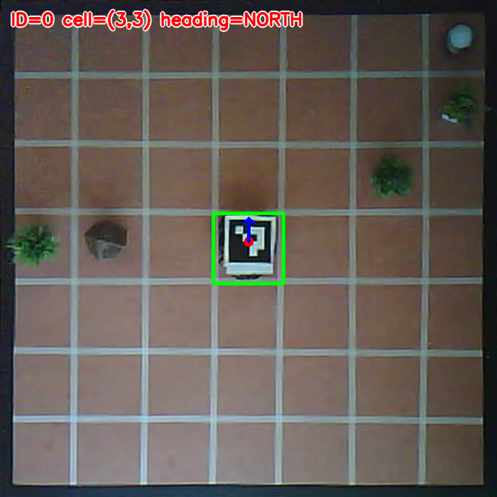
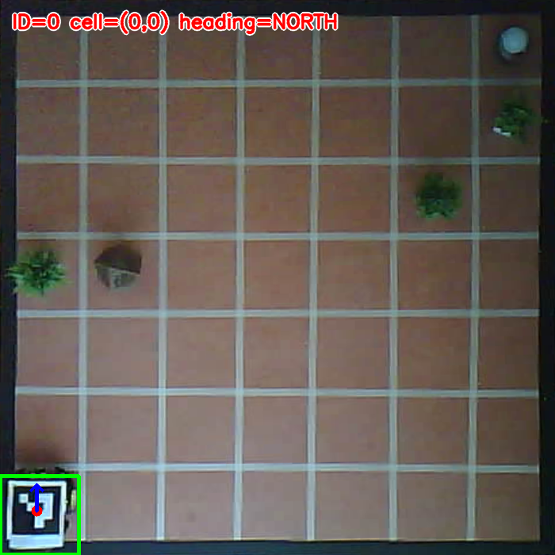
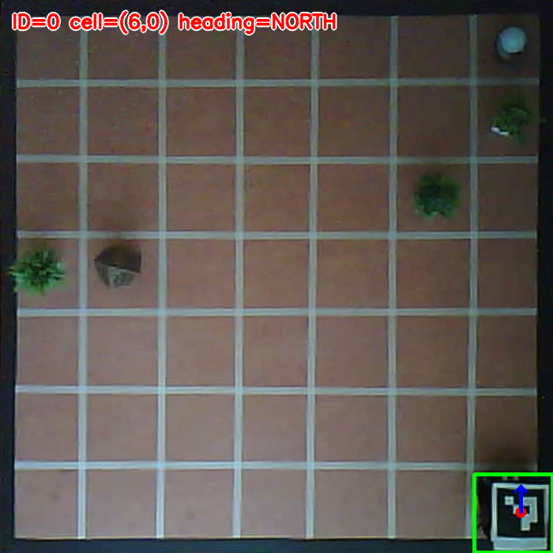
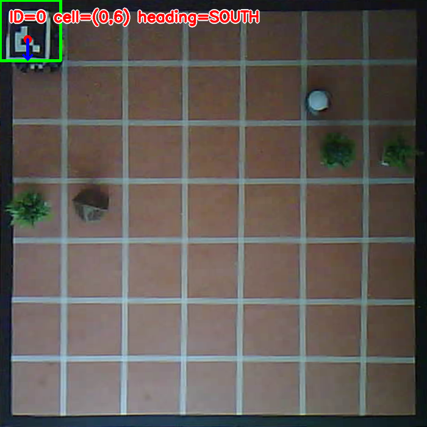
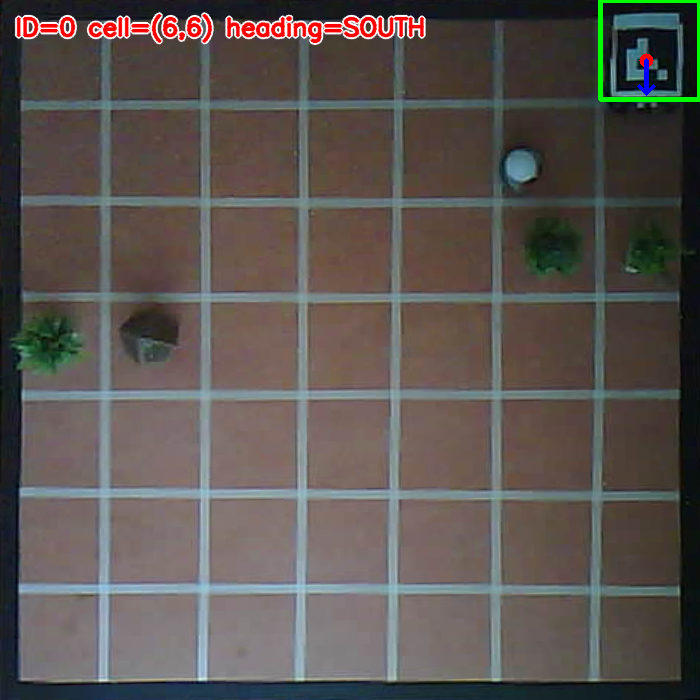

# Implementation Draft I-1.0 - Physical Vision and End-to-End V1 Integration

| Field | Value |
|---|---|
| Status | In progress |
| Date | 2026-10-03 |
| Repository branch | `implementation/i-1.0` |

## 1. Objective

I-1.0 integrates the validated I-0.8 software architecture with the physical
prototype established and calibrated through I-0.9.

Its objective is to complete the physical Version 1 mission while preserving
the existing separation of responsibilities:

- the fixed overhead ESP32-CAM provides global visual observations;
- the Arduino UNO R4 Minima performs low-level actuation and immediate local
  sensor reactions;
- the validated Brain, Planning, Control, Memory, and Perception boundaries
  remain responsible for high-level mission behaviour;
- hardware-specific details remain isolated in adapters and explicit tools.

The final I-1.0 system must convert physical observations into the same
platform-independent domain values already exercised by the deterministic
simulation.

## 2. Transition from I-0.9

I-0.9 validated the first physical hardware prototype, including:

- light-triggered mission activation;
- independently controlled TT motors;
- local infrared obstacle reactions;
- frontal ultrasonic distance measurement;
- black-boundary detection;
- motor restart assistance after reverse and turning manoeuvres;
- combined light and distance confirmation near the target;
- two consecutive complete physical regression missions.

I-1.0 does not replace this hardware baseline. It extends it with global
camera-based localization, explicit microcontroller communication, calibrated
grid movement, and complete physical mission orchestration.

## 3. Scope Boundary

I-1.0 includes:

- fixed overhead ESP32-CAM capture over Wi-Fi;
- validation of stable camera operation;
- perspective calibration of the physical grid;
- conversion between source-image pixels and logical grid cells;
- robot identification, position, and cardinal-heading estimation;
- a physical adapter compatible with the existing `PerceptionPort`;
- explicit communication between the host software and Arduino firmware;
- calibrated 20 cm cell traversal;
- repeatable cardinal rotations;
- physical execution of planned paths;
- integrated target, obstacle, safety, collection, and return behaviour;
- complete end-to-end physical V1 acceptance scenarios.

I-1.0 does not include:

- the planned second robot;
- competitive or cooperative multi-robot missions;
- the future line-following specialization of the first prototype;
- dynamic relocation of the overhead camera during a mission;
- production-grade localization redundancy;
- Version 2 behaviour.

Those capabilities remain outside the Version 1 completion boundary.

## 4. Fixed Overhead Grid Baseline

The operational camera-visible grid uses the following geometry:

| Property | Value |
|---|---|
| Logical columns | 7 |
| Logical rows | 7 |
| Physical cell size | 20 cm by 20 cm |
| Operational grid size | 140 cm by 140 cm |
| ESP32-CAM source resolution | 800 by 600 pixels |
| Rectified resolution | 700 by 700 pixels |
| Rectified pixels per cell | 100 |
| Logical origin | Bottom-left cell `(0, 0)` |

The external white area surrounding the black grid boundary remains available
as a physical safety margin. It is not part of the logical 7 by 7 planning
space.

The camera is installed at a fixed elevated position and points downward toward
the complete operational grid. It is powered independently through a 5 V, 2 A
powerbank.

A continuous camera experiment ran for approximately 30 to 40 minutes without
a connection or image failure.

The camera calibration remains valid only while the camera position, angle,
resolution, and visible grid boundaries remain unchanged. The rectified
reference must be reviewed after every camera removal or powerbank service.

## 5. Perspective Calibration

The current source-image calibration uses four ordered inner black-boundary
corners:

| Corner | Source x | Source y |
|---|---:|---:|
| Top-left | 106.0 | 1.0 |
| Top-right | 597.0 | 2.0 |
| Bottom-right | 588.0 | 471.0 |
| Bottom-left | 122.0 | 480.0 |

The versioned calibration is stored in:

`configs/hardware/grid_calibration_7x7.yaml`

The source and rectified references are stored in:

- `docs/assets/i-1.0/images/grid-reference-7x7-svga.jpg`;
- `docs/assets/i-1.0/images/grid-reference-7x7-rectified.jpg`.

`tools/calibrate_grid.py` provides an explicit four-corner calibration workflow.
It writes both the YAML configuration and a reviewable rectified reference.

The camera IP address is not stored in the calibration because it can change
through DHCP. Runtime commands receive the current camera HTTP origin
explicitly.

## 6. Camera Capture and Rectification Pipeline

The current physical vision pipeline is:

1. `Esp32CameraClient` retrieves one JPEG frame from `/capture`.
2. The JPEG boundaries are validated before decoding.
3. `CalibratedGridCamera` decodes the frame through OpenCV.
4. The source dimensions are checked against the stored calibration.
5. The perspective transform produces a 700 by 700 rectified grid image.
6. Hardware and network failures are exposed through explicit adapter errors.

The following tools support controlled diagnostics:

- `tools/check_esp32_cam.py` validates raw HTTP JPEG capture;
- `tools/calibrate_grid.py` creates the perspective calibration;
- `tools/check_calibrated_grid.py` captures and rectifies a live grid frame;
- `tools/check_robot_pose.py` localizes and annotates the configured robot
  marker.

The live calibrated pipeline has been exercised successfully against the fixed
ESP32-CAM.

## 7. ArUco Robot Localization

The Version 1 robot is assigned:

| Property | Value |
|---|---|
| Dictionary | `DICT_4X4_50` |
| Marker identifier | `0` |
| Printed image size | 8 cm by 8 cm |
| Marker asset | `docs/assets/i-1.0/images/robot-marker-aruco-id-0.png` |

The top edge of the printed marker must point toward the physical front of the
robot.

`ArucoRobotDetector` converts one rectified marker detection into:

- the decoded marker identifier;
- the rectified center coordinates;
- a zero-based logical `Position`;
- a cardinal `Heading`;
- the existing immutable `RobotPose` domain value.

The coordinate conversion applies these rules:

- image columns increase toward the right;
- image rows increase toward the bottom;
- logical `x` increases toward the right;
- logical `y` increases toward the top;
- image-up maps to `NORTH`;
- image-right maps to `EAST`;
- image-down maps to `SOUTH`;
- image-left maps to `WEST`.

The detector refuses to fabricate a pose when marker `0` is missing. It also
rejects a frame when the configured identifier appears more than once.

Synthetic tests validate all four headings, opposite image and domain
y-directions, corner cells, invalid identifiers, missing markers, and duplicate
markers.

The printed marker was mounted flat on the robot roof and physically validated
on 2026-10-05. Live overhead localization correctly identified all four
cardinal headings at logical position `(3, 3)` and correctly classified the
four operational corner cells `(0, 0)`, `(6, 0)`, `(6, 6)`, and `(0, 6)`.

The perspective calibration describes the floor plane while the marker is
elevated on the robot roof. A small expected parallax therefore appears near
the outer grid boundaries. Keeping the robot and marker toward the center of
each cell preserved complete marker visibility and produced the correct
logical pose. One initial detection miss near the upper boundary was resolved
by moving the robot inward within the same cell; no calibration change was
required.

### 7.1 Physical Localization Evidence

| Grid center | Bottom-left corner | Bottom-right corner |
|---|---|---|
|  |  |  |

| Top-left corner | Top-right corner |
|---|---|
|  |  |

## 8. Completed I-1.0 Batches

| Commit | Delivered capability |
|---|---|
| `83da8c5` | ESP32-CAM HTTP capture adapter |
| `804dc1e` | Overhead grid perspective calibration |
| `ca81693` | Live calibrated grid capture |
| `64bd12a` | ArUco robot localization |
| `b565fda` | Physical grid `PerceptionPort` adapter |
| `17fbf5c` | Physical ArUco localization across the operational grid |

The Batch B software foundation now composes calibrated camera capture, ArUco
localization, deterministic timestamping, and confirmed external state into
immutable `PerceptionSnapshot` values. Missing or ambiguous localization
remains an explicit failure and never produces a fabricated robot pose.

These batches preserve the platform-independent I-0.8 core. OpenCV and NumPy
remain optional vision dependencies rather than mandatory simulation
dependencies.

## 9. Current Verification Record

The repository and camera pipeline were verified on 2026-10-05.

| Verification | Result |
|---|---|
| ESP32-CAM Wi-Fi connection | Passed |
| Raw `/capture` JPEG retrieval | Passed |
| 800 by 600 source-frame validation | Passed |
| 7 by 7 perspective calibration | Passed |
| 700 by 700 live rectification | Passed |
| Synthetic ArUco ID `0` detection | Passed |
| Four cardinal marker orientations | Passed |
| Logical cell conversion | Passed |
| Missing and duplicate marker rejection | Passed |
| `python tools/check_project_structure.py` | Passed |
| Complete automated test suite | Passed: 413 tests |
| `python -m ruff check .` | Passed |
| `python -m mypy src` | Passed: 53 source files |
| `python -m pip check` | Passed: no broken requirements |
| `python -m build` | Passed: source archive and wheel created |
| Physical `PerceptionPort` snapshot composition | Passed |
| Physical ArUco marker installation | Passed |
| Physical four-heading validation at `(3, 3)` | Passed |
| Physical corner-cell localization | Passed: `(0, 0)`, `(6, 0)`, `(6, 6)`, and `(0, 6)` |

Physical ArUco validation is complete. The mounted marker was detected in all
four cardinal orientations at the grid center and in all four operational
corner cells. The small boundary parallax caused by marker elevation remains
compatible with cell-level navigation because physical commands will target
cell centers.

## 10. Planned Integration Batches

### Batch A - Physical Marker Validation

- [x] print the marker at exactly 8 cm by 8 cm;
- [x] preserve its white quiet-zone margin;
- [x] mount it flat on the robot roof;
- [x] align its top edge with the robot front;
- [x] confirm detection in several cells;
- [x] confirm all four cardinal orientations;
- [x] verify detection near the operational grid boundaries.

Batch A is complete. Physical localization passed at the grid center and at all
four operational corner cells.

### Batch B - Physical Perception Adapter

- [x] combine calibrated camera capture and robot localization;
- [x] produce the existing immutable `PerceptionSnapshot`;
- [ ] integrate physical target, obstacle, and hazard sources;
- [x] provide explicit failures when localization is unavailable;
- [x] satisfy the existing `PerceptionPort`.

The software foundation is complete. Target, obstacle, and hazard values
currently use explicit safe state updates until their physical sources are
connected through later vision and microcontroller batches.

### Batch C - Microcontroller Communication

- define a versioned host-to-Arduino protocol;
- transmit explicit movement and stop commands;
- receive command acknowledgements and sensor telemetry;
- apply timeouts and safe communication-loss behaviour;
- preserve immediate local safety reactions.

### Batch D - Cell Motion Calibration

- measure repeatable 20 cm forward movement;
- measure repeatable left and right 90-degree rotations;
- confirm final position through overhead localization;
- tune motor speeds and durations for the physical chassis;
- retain the I-0.9 motor-restart assistance where required.

### Batch E - End-to-End Physical V1

- execute planned outbound paths;
- replan around physical obstacles;
- stop in an authorized cell near the illuminated target;
- simulate collection while stationary;
- return through confirmed physical poses;
- stop safely after hazards or communication loss;
- repeat complete missions without restarting the software.

## 11. Known Limitations

The current I-1.0 implementation has these explicit limitations:

- marker elevation produces small expected parallax near the outer boundaries,
  so planned physical motion must target cell centers;
- camera calibration must be revalidated after camera or powerbank removal,
  reinstallation, or physical movement;
- the camera IP address can change through DHCP;
- the powerbank must be checked and recharged between experiments;
- global obstacle and target detection are not yet implemented;
- Arduino communication is not yet connected to the I-0.8 application;
- exact 20 cm movements and 90-degree rotations remain uncalibrated;
- the current Arduino firmware still contains autonomous experimental
  behaviours inherited from I-0.9;
- end-to-end planned physical path execution is not yet available.

## 12. I-1.0 Exit Conditions

- [x] Install the ESP32-CAM at a fixed overhead position.
- [x] Validate stable Wi-Fi JPEG capture.
- [x] Record a camera-visible 7 by 7 operational grid.
- [x] Create and validate a perspective calibration.
- [x] Produce live 700 by 700 rectified frames.
- [x] Define the robot ArUco dictionary and identifier.
- [x] Store the printable robot marker in the repository.
- [x] Validate synthetic cell and heading localization.
- [x] Print and mount the 8 cm by 8 cm robot marker.
- [x] Validate real marker detection across the physical grid.
- [x] Implement the physical `PerceptionPort` adapter.
- [ ] Implement explicit host-to-Arduino communication.
- [ ] Calibrate repeatable 20 cm movements.
- [ ] Calibrate repeatable 90-degree rotations.
- [ ] Integrate physical target and obstacle observations.
- [ ] Execute complete outbound, collection, and return missions.
- [ ] Run complete physical V1 regression scenarios.
- [ ] Update the public README and command-line status.
- [ ] Review and merge the I-1.0 pull request.

I-1.0 remains in progress until every physical integration and repository
closure condition is complete.