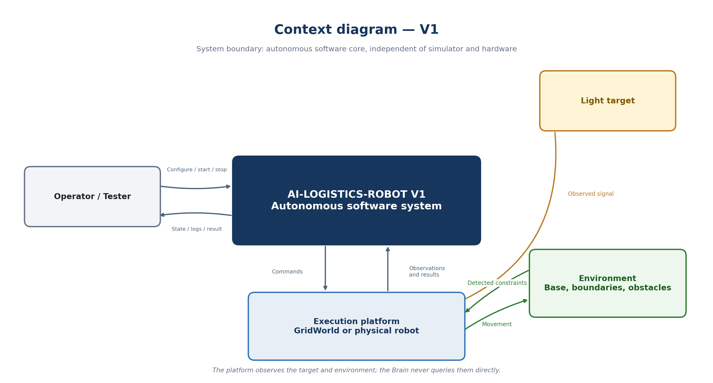
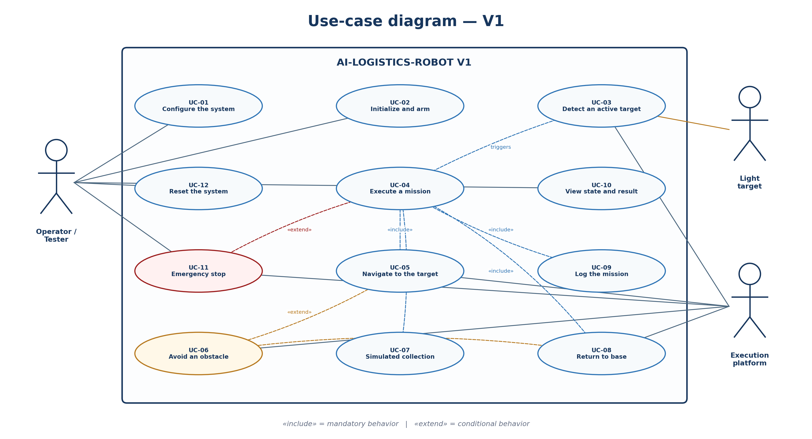

**AI-LOGISTICS-ROBOT**

**V1 Requirements Specification
Draft 0.2**

Logical Model, Interfaces, Simulator, and Initial System Diagrams

| **Project** | AI-Logistics-Robot                              |
|-------------|-------------------------------------------------|
| **Version** | Draft 0.2 — Standalone Supplement to Draft 0.1  |
| **Date**    | August 10, 2026                                 |
| **Status**  | Decisions approved through the use-case diagram |

*Draft 0.1 remains preserved separately and unchanged.*

# 1. Purpose and Scope of Draft 0.2

This document records the decisions made after Draft 0.1. It specifies the logical environment, movement model, path memory, simulator choice, objects exchanged between modules, interfaces, system context, and V1 use cases.

| **Session endpoint —** Draft 0.2 ends after the use-case diagram. The remaining diagrams, VS Code project structure, and traceability review will form Draft 0.3. |
|-------------------------------------------------------------------------------------------------------------------------------------------------------------------|

# 2. Summary of Approved Decisions

| **ID** | **Decision**       | **Approved Result**                                                     |
|--------|--------------------|-------------------------------------------------------------------------|
| D-01   | Environment        | 2 × 2 m area, 10 × 10 grid, 20 × 20 cm cells.                           |
| D-02A  | Simulation Target  | Exact position provided to Perception.                                  |
| D-02B  | Physical Target    | Future ESP32-CAM behind a Perception adapter.                           |
| D-03   | Return-Path Memory | Ordered sequence of poses actually reached.                             |
| D-04   | Simulation         | Headless Python GridWorld with optional Pygame visualization.           |
| D-05   | Modules            | Exchanges defined through interfaces and shared data objects.           |
| D-06   | Hardware           | Simulation and the physical robot are interchangeable through adapters. |

# 3. Physical and Logical Environment

## 3.1 Dimensions and Coordinates

| **Element**           | **Value**                 |
|-----------------------|---------------------------|
| Physical Environment  | 2 × 2 m, totaling 4 m²    |
| Logical Environment   | 10 × 10 cells             |
| Resolution            | 20 × 20 cm per cell       |
| Total Number of Cells | 100                       |
| X and Y Coordinates   | Integers from 0 to 9      |
| Origin                | (0,0), bottom-left corner |

This choice provides a good balance between instructional simplicity and V2 readiness. Two robots will later be able to share the same map without changing the coordinate convention.

## 3.2 Three-Layer Representation

| **Layer** | **V1 Values**      | **Responsibility**                  |
|-----------|--------------------|-------------------------------------|
| Terrain   | FREE, BLOCKED      | Describe stable physical occupancy. |
| Semantic  | NONE, BASE, TARGET | Describe the function of a cell.    |
| Dynamic   | empty, robot_1     | Describe moving entities.           |

The same cell may be free in the Terrain layer, marked BASE in the Semantic layer, and occupied by robot_1 in the Dynamic layer. This separation prepares waiting zones and the second V2 robot.

## 3.3 Pose and Headings

**RobotPose :** position (x,y) + heading.

| **Heading** | **Symbol** | **Vector** |
|-------------|------------|------------|
| North       | NORTH      | (0,+1)     |
| East        | EAST       | (+1,0)     |
| South       | SOUTH      | (0,-1)     |
| West        | WEST       | (-1,0)     |

# 4. Movement and Safety

## 4.1 Primitive Commands

| **Command**    | **Effect**                                    |
|----------------|-----------------------------------------------|
| MOVE_FORWARD   | Move forward one cell in the current heading. |
| TURN_LEFT      | Turn 90° left without changing cells.         |
| TURN_RIGHT     | Turn 90° right without changing cells.        |
| STOP           | Stop normal movement.                         |
| WAIT           | Remain stationary for a defined duration.     |
| EMERGENCY_STOP | Stop the motors immediately.                  |

The system does not use MOVE_NORTH or MOVE_EAST commands: the robot must turn before moving forward, like the real differential-drive vehicle.

## 4.2 Pre-Movement Validation

1.  The next cell lies within the grid.

2.  The cell is not blocked by an obstacle.

3.  The safety margin around obstacles is respected.

4.  The cell is not occupied by another robot.

5.  No emergency stop is active.

6.  The Brain has authorized the movement.

| **Safety invariant —** A rejected command does not change the robot pose and is never added to the successful path. |
|---------------------------------------------------------------------------------------------------------------------|

## 4.3 Robot Footprint

The initial simulation represents the robot by one central cell. The physical footprint remains configurable by width, length, and safety margin. It will be finalized after the vehicle is assembled and measured.

# 5. Target and Path Memory

## 5.1 Target Representation

**Simulation:** target_id, exact position, and active indicator.

**Physical world:** estimated observation, confidence level, source, and timestamp.

The ESP32-CAM will be an optional observation provider. The Brain will depend on neither a raw image nor the camera for immediate safety.

## 5.2 Outbound and Return Path Memory

The outbound path is an ordered sequence of poses actually reached. Turns may be retained as metadata, but only reached cells constitute the spatial path.

| **Example —** Outbound: (1,1) → (2,1) → (3,1) → (3,2) → (4,2). Return: sequence traversed in reverse order. |
|-------------------------------------------------------------------------------------------------------------|

- A turn alone does not add a new cell.

- A rejected movement is not recorded.

- A successful avoidance detour is recorded.

- The base is the first path point; the target is the last point of the outbound journey.

## 5.3 Reference Scenario

| **Base**               | (1,1)                                                     |
|------------------------|-----------------------------------------------------------|
| **Initial Robot Pose** | (1,1,NORTH)                                               |
| **Target**             | (8,7)                                                     |
| **Obstacles**          | (1,4), (2,4), (3,4), (5,6)                                |
| **Collection**         | 3 seconds                                                 |
| **Expected Result**    | Reach the target without collision, then return to (1,1). |

# 6. Selected Simulator

| **Decision D-04 —** V1 uses a GridWorld engine written in Python, executable without a graphical interface, with an optional PygameRenderer. |
|----------------------------------------------------------------------------------------------------------------------------------------------|

| **Element**     | **Responsibility**                                            |
|-----------------|---------------------------------------------------------------|
| GridWorld       | World state, rules, collisions, commands, and simulated time. |
| PygameRenderer  | Display of the grid, robot, paths, states, and events.        |
| Automated Tests | Run GridWorld without a graphical window.                     |

## 6.1 Tool Comparison

| **Tool**        | **Use**                                               | **V1 Decision**              |
|-----------------|-------------------------------------------------------|------------------------------|
| Python + Pygame | Instructional and controllable 2D logical simulation. | Selected.                    |
| Webots          | Simulated physics, motors, sensors, and cameras.      | Candidate for a later phase. |
| Gazebo + ROS 2  | 3D robotics and the ROS 2 ecosystem.                  | Outside V1 scope.            |

**References:** pygame.org/docs — cyberbotics.com/doc/guide — gazebosim.org/docs

# 7. Shared Data Objects

| **Object**          | **Main Content**                                                       |
|---------------------|------------------------------------------------------------------------|
| Position            | x, y                                                                   |
| RobotPose           | Position + heading                                                     |
| TargetObservation   | detection, activity, estimated position, confidence, source, timestamp |
| ObstacleObservation | blocked positions, source, timestamp                                   |
| PerceptionSnapshot  | pose, target, obstacles, emergency, timestamp                          |
| MotionCommand       | command_id, type, optional duration, date                              |
| CommandResult       | success, before/after poses, failure cause                             |
| Mission             | identity, target, status, dates                                        |
| PathPlan            | start, goal, positions, validity                                       |
| PathRecord          | outbound poses, return poses, current index                            |

# 8. Interfaces Between Modules

An interface is a contract: it specifies inputs, outputs, and responsibilities without imposing an implementation. In Python, these contracts may become Protocols or abstract classes.

## 8.1 Dependency Rules

- The Brain knows the interfaces, not concrete implementations.

- Pygame must never be imported into the Brain.

- Planning knows neither Arduino nor the motors.

- Perception observes but does not make mission decisions.

- Simulation executes world rules but does not choose the path.

- Hardware and simulation are replaceable behind the same contracts.

## 8.2 Public Contracts

| **Interface**  | **Conceptual Operations**                      | **Responsibility**                                                   |
|----------------|------------------------------------------------|----------------------------------------------------------------------|
| SimulationPort | reset, read_world, apply_command, advance_time | Provide access to the simulated world without exposing Pygame.       |
| PerceptionPort | observe                                        | Normalize simulation, sensors, and camera into a PerceptionSnapshot. |
| BrainPort      | update                                         | Orchestrate the mission and states; decide what to do.               |
| PlanningPort   | create_plan, next_step                         | Calculate a safe path without knowing the motors.                    |
| ControlPort    | create_commands, execute                       | Transform a next position into commands.                             |
| MemoryPort     | start, record, build_return_path, complete     | Store poses, events, and the result.                                 |
| MonitoringPort | publish, publish_error, publish_state_change   | Make behavior observable.                                            |
| RendererPort   | render, display_path, display_event            | Display without influencing decisions.                               |

## 8.3 Conceptual Sequence of One Cycle

| **Step** | **Exchange**                                                   |
|----------|----------------------------------------------------------------|
| 1        | Simulation or sensors → Perception: raw world data.            |
| 2        | Perception → Brain: normalized PerceptionSnapshot.             |
| 3        | Brain → Planning: request for a plan or next position.         |
| 4        | Planning → Brain: PathPlan or safe next step.                  |
| 5        | Brain → Control: validated movement intent.                    |
| 6        | Control → Simulation or robot: primitive command.              |
| 7        | Brain → Memory and Monitoring: pose, event, state, and result. |

**9. Official Context Diagram — V1**

Figure 1 — The software core is the system boundary under study; GridWorld and the physical robot are interchangeable external platforms.

## 9.1 Reading the Context Diagram

| **External Entity** | **Primary Exchanges**                                                     |
|---------------------|---------------------------------------------------------------------------|
| Operator/Tester     | Configuration, startup, and stop; reception of states, logs, and results. |
| Execution Platform  | Observations and results to the core; movement commands in return.        |
| Light Target        | Activation and signal observed through the platform.                      |
| Environment         | Base, boundaries, and obstacles; physically receives movement.            |

## 9.2 Context Assumptions

- One robot and one active mission in V1.

- The operator supervises but does not drive the robot during the mission.

- The camera supplements Perception but is not responsible for urgent safety.

- The autonomous system has no mandatory dependency on a central station.

## 9.3 Context Inputs and Outputs

| **Direction** | **Primary Flow**                         |
|---------------|------------------------------------------|
| To the Core   | Configuration, startup, emergency stop.  |
| To the Core   | Observations, pose, and command results. |
| From the Core | Movement and stop commands.              |
| From the Core | States, logs, errors, and final result.  |

## 9.4 Context Decisions

| **ID** | **Decision**                                                     |
|--------|------------------------------------------------------------------|
| CTX-01 | The system boundary under study is the autonomous software core. |
| CTX-02 | Simulation and hardware are interchangeable platforms.           |
| CTX-03 | The operator supervises but does not drive.                      |
| CTX-04 | The target is observed through the platform and Perception.      |
| CTX-05 | Immediate safety does not depend on the camera.                  |
| CTX-06 | The core does not depend on a central station.                   |

**10. Official Use-Case Diagram — V1**

Figure 2 — Mandatory use cases are connected by «include»; avoidance and emergency stop are conditional («extend»).

## 10.1 Actors

| **Actor**          | **Role**                                           |
|--------------------|----------------------------------------------------|
| Operator/Tester    | Configure, initialize, supervise, stop, and reset. |
| Light Target       | Automatically trigger a mission.                   |
| Execution Platform | Provide observations and execute commands.         |

## 10.2 Use-Case Catalog

| **Use Case**            | **Purpose**                                                                 | **Result**                          |
|-------------------------|-----------------------------------------------------------------------------|-------------------------------------|
| UC-01 — Configure       | Prepare the grid, base, robot, target, obstacles, duration, and thresholds. | Valid configuration.                |
| UC-02 — Initialize      | Load and verify the modules, then arm the system.                           | WAITING_FOR_MISSION.                |
| UC-03 — Detect          | Identify an active target through the platform.                             | Mission created.                    |
| UC-04 — Execute Mission | Coordinate outbound travel, collection, return, and completion.             | Mission completed or failed.        |
| UC-05 — Navigate        | Plan and execute steps to the target.                                       | Target zone reached.                |
| UC-06 — Avoid           | Reject the hazard, replan, and resume.                                      | Safe detour or failure.             |
| UC-07 — Collect         | Stop and wait for the configured duration.                                  | Collection completed.               |
| UC-08 — Return          | Follow the recorded path in reverse order.                                  | Base reached.                       |
| UC-09 — Log             | Record states, commands, poses, events, and result.                         | Reconstructible mission.            |
| UC-10 — View Status     | Present state, pose, mission, paths, and errors.                            | Information with no control effect. |
| UC-11 — Emergency Stop  | Stop immediately and wait for an explicit recovery action.                  | SAFETY_STOP.                        |
| UC-12 — Reset           | Clear temporary state and reload the configuration.                         | New initialization.                 |

## 10.3 UC-04 Nominal Scenario

| **Step** | **Action**                                                            |
|----------|-----------------------------------------------------------------------|
| 1        | The target becomes active and the platform produces an observation.   |
| 2        | Perception identifies the target; the Brain creates the mission.      |
| 3        | Planning calculates the outbound path.                                |
| 4        | Control executes movements and Memory records successful poses.       |
| 5        | The Brain confirms arrival and performs the simulated collection.     |
| 6        | Memory prepares the return path.                                      |
| 7        | The robot returns to base; Monitoring completes and logs the mission. |
| 8        | The Brain returns to WAITING_FOR_MISSION.                             |

## 10.4 Alternative Scenarios

**A1 — Obstacle:** reject the movement, update the map, replan, and resume.

**A2 — No path:** stop, set the mission to FAILED, and log the cause.

**A3 — Target deactivated:** continue toward the position recorded when the mission was accepted.

**A4 — Obstacle during return:** create a local detour, then rejoin an accessible point on the return path.

**A5 — Emergency:** stop immediately and prohibit any automatic recovery.

# 11. Initial Traceability

| **Use Case** | **Linked Requirements** |
|--------------|-------------------------|
| UC-01        | NFR-06, NFR-10          |
| UC-02        | FR-01, FR-02            |
| UC-03        | FR-03 to FR-05          |
| UC-05        | FR-06 to FR-11          |
| UC-06        | FR-07 to FR-10, FR-18   |
| UC-07        | FR-12 to FR-15          |
| UC-08        | FR-16 to FR-20          |
| UC-09        | FR-21, FR-22, NFR-07    |
| UC-11        | FR-23, FR-24            |
| UC-12        | AC-11                   |

# 12. Session Findings and Corrections

| **Observation**                                         | **Approved Correction or Principle**                        |
|---------------------------------------------------------|-------------------------------------------------------------|
| One cell value is not sufficient to describe the world. | Separate Terrain, Semantic, and Dynamic layers.             |
| A position alone does not describe a vehicle.           | Add heading to RobotPose.                                   |
| A graphical simulator can contaminate the core.         | Separate headless GridWorld from PygameRenderer.            |
| A camera can become a fragile dependency.               | Place it behind Perception and retain local safety.         |
| Too many public methods make modules more complex.      | Keep interfaces short; add details internally.              |
| Large diagrams may be split across pages.               | Use a landscape section and one dedicated page per diagram. |

# 13. Planned Content for Draft 0.3

- Detailed component diagram.

- Complete state machine and error transitions.

- Primary sequence diagrams.

- Class diagram and data-model validation.

- Technical repository structure in VS Code.

- Complete requirements → modules → tests matrix.

- Consistency review before creating the project skeleton.

| **Final status of Draft 0.2 —** The logical model, interfaces, simulator, context, and use cases are sufficiently defined to continue the design in the next session, without starting implementation yet. |
|------------------------------------------------------------------------------------------------------------------------------------------------------------------------------------------------------------|
