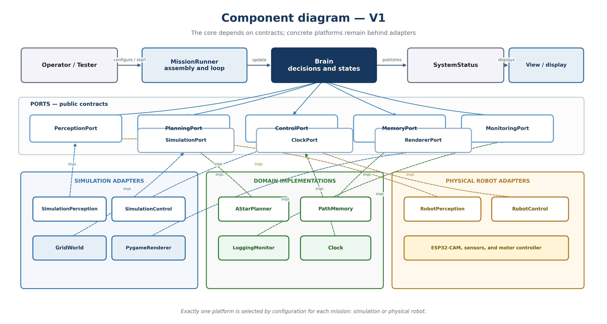
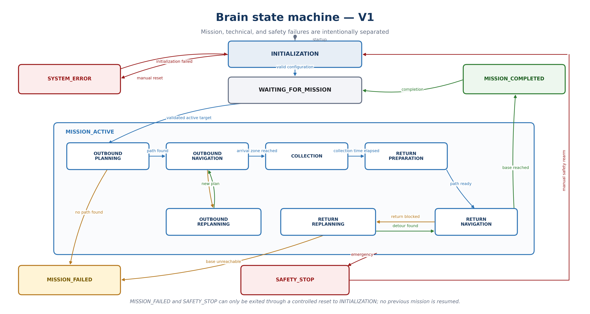
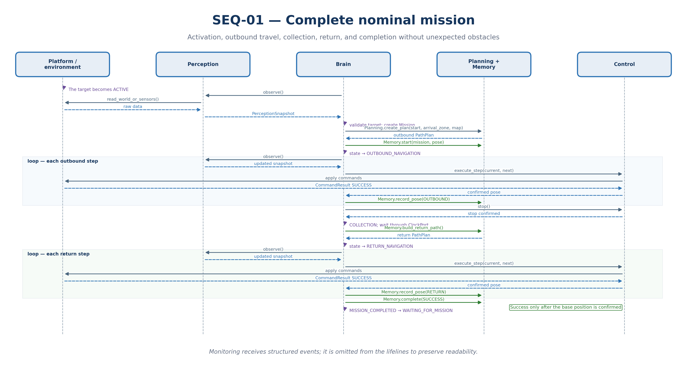
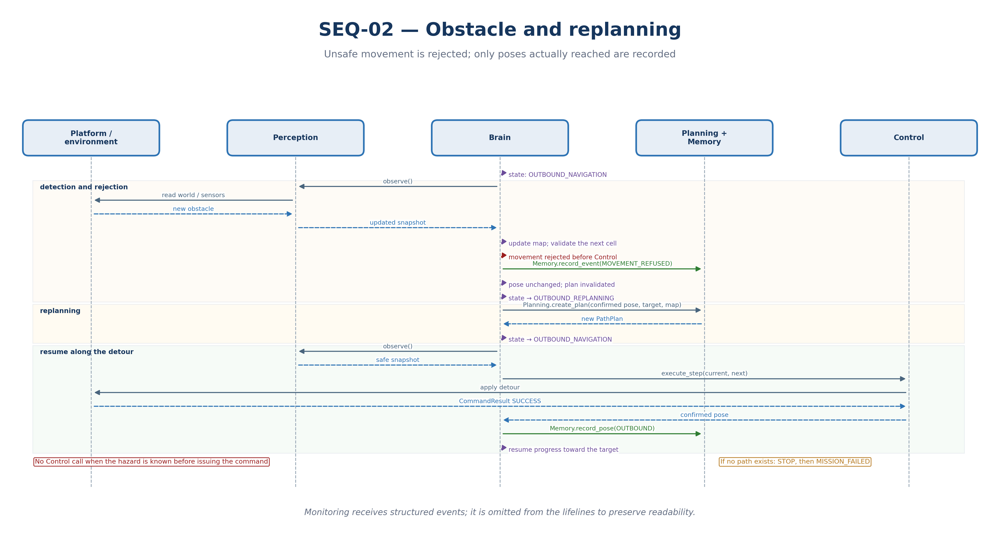
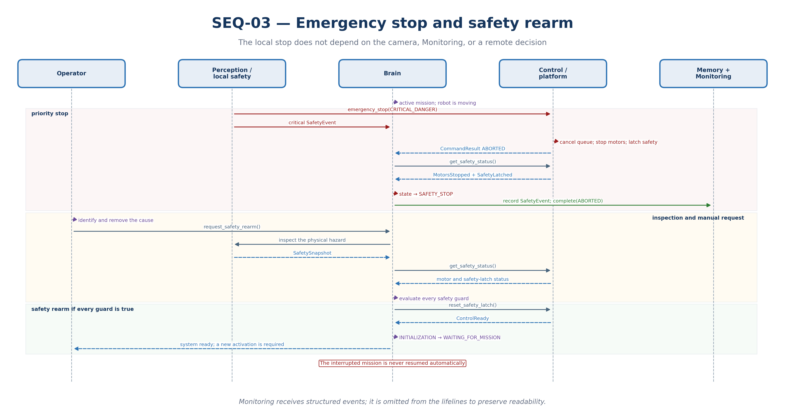
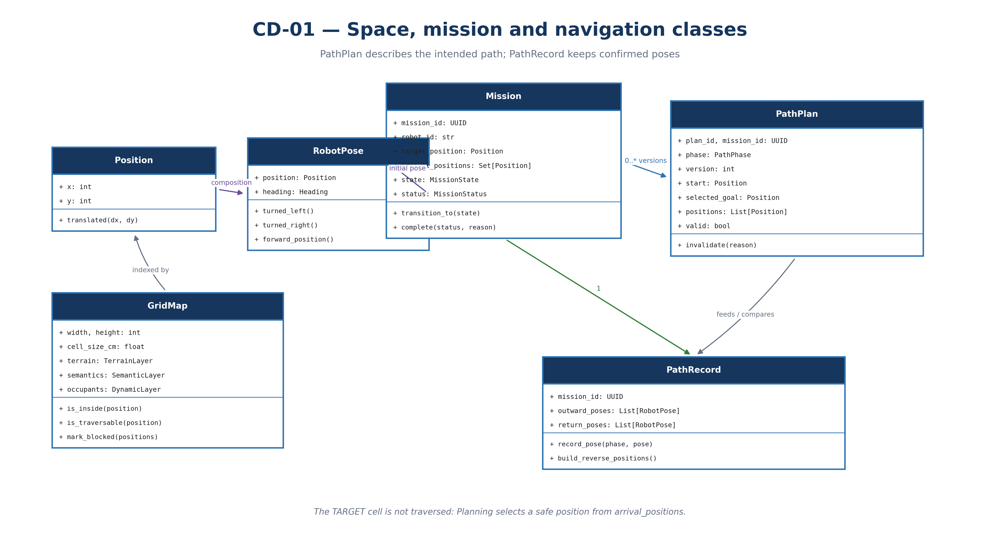
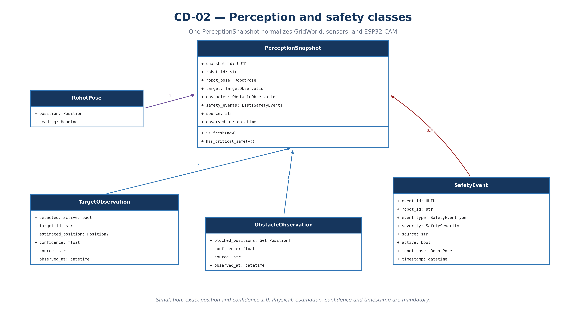
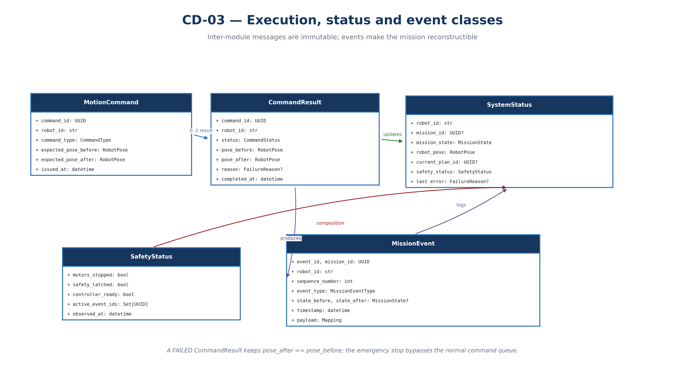
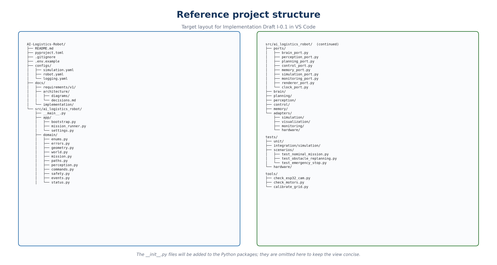

**AI-LOGISTICS-ROBOT**

**V1 Requirements Specification
Draft 0.3**

Detailed Architecture, Models, Project Structure, and Final Review

| **Project** | AI-Logistics-Robot                                        |
|-------------|-----------------------------------------------------------|
| **Version** | Draft 0.3 — Standalone Supplement to Drafts 0.1 and 0.2   |
| **Date**    | August 11, 2026                                           |
| **Status**  | Architecture approved — GO for Implementation Draft I-0.1 |

*Drafts 0.1 and 0.2 remain preserved separately and unchanged.*

# 1. Purpose and Status of Draft 0.3

This document completes the V1 design before code is written. It extends Draft 0.2 with the detailed internal architecture, state machine, primary sequences, class model, technical project structure, traceability, and final review.

| **Phase-gate decision —** After integrating clarifications REV-01 through REV-09, no additional diagram is required before creating the Python project skeleton. |
|------------------------------------------------------------------------------------------------------------------------------------------------------------------|

## 1.1 Content

- Component diagram and dependency rules.

- Complete Brain state machine.

- Three sequences: nominal mission, obstacle, and emergency stop.

- Three views of the class model.

- Reference project structure for VS Code.

- Corrected public contracts and cross-cutting objects.

- Requirements → modules → tests matrix.

- Final implementation-readiness verdict.

## 1.2 Inherited References

| **Source** | **Preserved Elements**                                                      |
|------------|-----------------------------------------------------------------------------|
| Draft 0.1  | Vision, scope, FR-01 to FR-24, NFR-01 to NFR-10, and AC-01 to AC-12.        |
| Draft 0.2  | 10 × 10 grid, logical model, interfaces, simulator, context, and use cases. |
| Draft 0.3  | Internal design, final corrections, project structure, and coverage review. |

**2. Official Component Diagram — V1**

Figure 1 — MissionRunner assembles the implementations; the Brain depends only on public contracts.

## 2.1 Responsibilities and Decisions

| **ID** | **Approved Decision**                                                          |
|--------|--------------------------------------------------------------------------------|
| CMP-01 | MissionRunner assembles and executes the loop without making domain decisions. |
| CMP-02 | Brain depends only on ports and domain objects.                                |
| CMP-03 | GridWorld and the physical robot are interchangeable through configuration.    |
| CMP-04 | Pygame is a passive display.                                                   |
| CMP-05 | Domain remains independent of platforms.                                       |
| CMP-06 | Only one platform is active during a mission.                                  |
| CMP-07 | V2 will add a coordinator, without implementing it in V1.                      |

## 2.2 Permitted Dependency Direction

- domain depends on no project module.

- ports depends only on domain.

- brain, planning, perception, control, and memory depend on ports and domain.

- adapters depends on ports, domain, and the required external libraries.

- app/bootstrap.py is the only location that knows all implementations.

- No Arduino, ESP32, Pygame, or GridWorld import is allowed in the Brain.

**3. Official State Machine — V1**

Figure 2 — The machine distinguishes mission failure, technical error, and safety stop.

## 3.1 State Catalog

| **State**           | **Responsibility**                                                  |
|---------------------|---------------------------------------------------------------------|
| INITIALIZATION      | Load the configuration, create the components, and verify them.     |
| WAITING_FOR_MISSION | Robot stationary; wait for a new valid activation.                  |
| OUTBOUND_PLANNING   | Calculate a path to a safe position in the arrival zone.            |
| OUTBOUND_NAVIGATION | Observe, validate, move, and record confirmed poses.                |
| OUTBOUND_REPLANNING | Update the map and search for a detour.                             |
| COLLECTION          | Stop the robot and wait through ClockPort.                          |
| RETURN_PREPARATION  | Build the reverse path from PathRecord.                             |
| RETURN_NAVIGATION   | Follow the return path while maintaining safety.                    |
| RETURN_REPLANNING   | Rejoin the next accessible point or recalculate a path to the base. |
| MISSION_COMPLETED   | Complete a successful mission and return to waiting.                |
| MISSION_FAILED      | Complete an unrecoverable mission failure.                          |
| SYSTEM_ERROR        | Lock the system after a critical technical failure.                 |
| SAFETY_STOP         | Priority stop, latched and rearmable only manually.                 |

## 3.2 Invariants

- Only the Brain changes the mission state.

- The motors move only during navigation states.

- An unconfirmed pose is never recorded as successful.

- SAFETY_STOP has priority over all transitions.

- An ABORTED mission is never resumed automatically.

- Every transition produces an ordered MissionEvent.

**4.1 Sequence SEQ-01 — Nominal Mission**

Figure 3 — End-to-end nominal sequence, including outbound travel, collection, and return.

**4.2 Sequence SEQ-02 — Obstacle and Replanning**

Figure 4 — The rejected movement does not change the pose and is not added to the path.

**4.3 Sequence SEQ-03 — Emergency Stop**

Figure 5 — The local stop precedes logging and requires manual safety rearm.

## 4.4 Contracts Revealed by the Sequences

| **Interaction**            | **Result**                                             |
|----------------------------|--------------------------------------------------------|
| Perception.observe()       | Immutable, timestamped PerceptionSnapshot.             |
| Planning.create_plan()     | Versioned PathPlan to an authorized position.          |
| Control.execute_step()     | CommandResult with confirmed before/after poses.       |
| Memory.record_pose()       | Add a successful pose in the OUTBOUND or RETURN phase. |
| Memory.build_return_path() | Confirmed outbound positions in reverse order.         |
| Control.emergency_stop()   | Motors stopped and SafetyStatus latched.               |
| Brain.get_status()         | SystemStatus readable without any control effect.      |

| **Synchronous principle —** The V1 core uses a deterministic loop. Adapters may perform asynchronous input/output internally, but they will present consistent results to the Brain. |
|--------------------------------------------------------------------------------------------------------------------------------------------------------------------------------------|

**5.1 Classes CD-01 — Mission and Navigation**

Figure 6 — The mission has an actual history and potentially several plan versions.

**5.2 Classes CD-02 — Perception and Safety**

Figure 7 — Observations remain independent of their simulated or physical source.

**5.3 Classes CD-03 — Execution, Status, and Events**

Figure 8 — Results, statuses, and events make behavior verifiable.

## 5.4 Object Ownership

| **Object**         | **Primary Creator or Owner**                                             |
|--------------------|--------------------------------------------------------------------------|
| GridMap            | Initialized by the platform; active reference orchestrated by the Brain. |
| Mission            | Brain.                                                                   |
| PathPlan           | Planning.                                                                |
| PathRecord         | Memory.                                                                  |
| PerceptionSnapshot | Perception.                                                              |
| MotionCommand      | Control.                                                                 |
| CommandResult      | Control or platform adapter.                                             |
| SafetyEvent        | Operator, local safety, Control, or Perception.                          |
| MissionEvent       | Component originating the event, sequenced by Monitoring.                |
| SystemStatus       | Brain, assembled from confirmed states.                                  |

## 5.5 Data Rules

- Position, RobotPose, observations, commands, results, events, and statuses are immutable.

- Valid coordinates are integers from 0 to 9.

- Every confidence value lies within \[0.0, 1.0\].

- A FAILED result preserves pose_after == pose_before.

- A SUCCESS mission requires completed collection and confirmed base arrival.

- An ABORTED mission requires an explicit cause.

- No raw dictionary serves as a public contract; event payloads remain read-only.

## 5.6 Primary Enumerations

| **Enumeration** | **Primary Values**                                                                                           |
|-----------------|--------------------------------------------------------------------------------------------------------------|
| Heading         | NORTH, EAST, SOUTH, WEST                                                                                     |
| MissionStatus   | CREATED, ACTIVE, SUCCESS, FAILED, ABORTED                                                                    |
| PathPhase       | OUTBOUND, RETURN, DETOUR                                                                                     |
| CommandType     | MOVE_FORWARD, TURN_LEFT, TURN_RIGHT, STOP                                                                    |
| CommandStatus   | SUCCESS, FAILED, ABORTED, TIMEOUT                                                                            |
| SafetySeverity  | INFO, WARNING, CRITICAL                                                                                      |
| FailureReason   | BLOCKED, NO_PATH, OUT_OF_BOUNDS, SAFETY_LATCHED, TIMEOUT, COMMUNICATION_LOSS, EMERGENCY_STOP, INTERNAL_ERROR |

**6. Official Technical Project Structure**

Figure 9 — Target project structure; creating it will constitute Implementation Draft I-0.1.

## 6.1 Directory Responsibilities

| **Directory** | **Responsibility**                                            |
|---------------|---------------------------------------------------------------|
| app           | Assembly, configuration, loop, and operator operations.       |
| domain        | Objects, enumerations, and rules with no platform dependency. |
| ports         | Short public contracts.                                       |
| brain         | State machine and mission orchestration.                      |
| planning      | A\* and path validation.                                      |
| perception    | Target validation, triggering, and map updates.               |
| control       | Step construction, commands, and safeguards.                  |
| memory        | Actual path, events, and result.                              |
| adapters      | Simulation, Pygame, logs, and hardware.                       |
| tests         | Unit, integration, scenario, and hardware tests.              |
| tools         | Separate camera, motor, and calibration diagnostics.          |

## 6.2 Implementation Work Breakdown

| **Draft** | **Session**                                         |
|-----------|-----------------------------------------------------|
| I-0.1     | Project, Python environment, and project structure. |
| I-0.2     | Domain objects, configuration, and enumerations.    |
| I-0.3     | Ports and public contracts.                         |
| I-0.4     | GridWorld and movement rules.                       |
| I-0.5     | Planning and Memory.                                |
| I-0.6     | Brain, state machine, and Control.                  |
| I-0.7     | PygameRenderer.                                     |
| I-0.8     | Complete scenarios and acceptance tests.            |
| I-0.9     | Hardware diagnostics and calibration.               |
| I-1.0     | Physical integration and V1 validation.             |

# 7. Final Public Contracts

| **Interface**  | **Conceptual Operations**                                                 | **Responsibility**                                     |
|----------------|---------------------------------------------------------------------------|--------------------------------------------------------|
| BrainPort      | update, get_status, reset                                                 | Orchestrate the mission and expose read-only status.   |
| PerceptionPort | observe                                                                   | Produce a normalized PerceptionSnapshot.               |
| PlanningPort   | create_plan                                                               | Plan from a pose to a set of authorized goals.         |
| ControlPort    | execute_step, stop, emergency_stop, get_safety_status, reset_safety_latch | Execute one step and ensure local safety.              |
| MemoryPort     | start, record_pose, record_event, build_return_path, complete, reset      | Store poses, events, and the result.                   |
| SimulationPort | reset, read_world, apply_command, advance_time                            | Execute GridWorld rules.                               |
| MonitoringPort | publish, events_for                                                       | Log structured MissionEvents and read them back.       |
| RendererPort   | render, display_event                                                     | Display without influencing decisions.                 |
| ClockPort      | now, monotonic, wait_until                                                | Make real time, simulation, and tests interchangeable. |

## 7.1 MissionRunner Operations

| **Operation**                  | **Effect**                                       |
|--------------------------------|--------------------------------------------------|
| configure(settings)            | Validate and store the configuration.            |
| start()                        | Initialize, then start the loop.                 |
| stop()                         | Request a normal stop.                           |
| request_emergency_stop(reason) | Trigger the priority safety chain.               |
| request_safety_rearm()         | Attempt safety rearm under guard conditions.     |
| reset()                        | Clear temporary state without restarting Python. |
| get_status()                   | Provide read-only SystemStatus.                  |

# 8. Final Review and Closing Corrections

| **ID** | **Topic**       | **Resolution**                                                                                                       |
|--------|-----------------|----------------------------------------------------------------------------------------------------------------------|
| REV-01 | Arrival         | The target is not traversed; Planning selects a safe adjacent cell. Exact base position (1,1), unrestricted heading. |
| REV-02 | Triggering      | One mission only on the INACTIVE → ACTIVE edge; configurable debounce for hardware.                                  |
| REV-03 | Control         | Final contract with execute_step and explicit safety operations.                                                     |
| REV-04 | Commands        | WAIT is managed by Brain/Clock; EMERGENCY_STOP is a priority operation outside the normal queue.                     |
| REV-05 | Failures        | MISSION_FAILED, SYSTEM_ERROR, and SAFETY_STOP are distinguished.                                                     |
| REV-06 | Monitoring      | Brain decides, Memory stores, and Monitoring observes and logs.                                                      |
| REV-07 | Traceability    | Addition of MissionEvent, SystemStatus, and requirements FR-25 to FR-27.                                             |
| REV-08 | Reproducibility | Scenario ID, ClockPort, and an optional seed make tests replayable.                                                  |
| REV-09 | V2 and Hardware | robot_id propagated; physical footprint to be measured before integration.                                           |

## 8.1 Added Requirements

**FR-25 —** The operator must be able to view the state, pose, mission, active plan, and latest error without influencing control.

**FR-26 —** The system must be resettable and able to replay a scenario without restarting the program.

**FR-27 —** After an emergency stop, any recovery requires validated manual safety rearm; the previous mission is never resumed.

## 8.2 Minimum Configuration

| **Group**  | **Parameters**                                                         |
|------------|------------------------------------------------------------------------|
| Grid       | width, height, cell_size_cm, origin, base_position.                    |
| Robot      | robot_id, initial_pose, footprint, safety_margin.                      |
| Target     | target_position, arrival_tolerance, debounce_ms, confidence_threshold. |
| Mission    | collection_duration, timeouts, maximum_replans.                        |
| Movement   | speeds, turning durations, and forward-movement durations.             |
| Simulation | scenario_id, obstacles, simulated_clock, optional random_seed.         |
| Monitoring | level, destination, and structured format.                             |

# 9. Requirements → Modules → Tests Matrix

| **Requirements** | **Responsible Modules**           | **Primary Verification**                                  |
|------------------|-----------------------------------|-----------------------------------------------------------|
| FR-01 to FR-02   | App, Brain, Control               | Initialization and stationary behavior without a mission. |
| FR-03 to FR-05   | Perception, Brain, Mission        | One mission per activation edge.                          |
| FR-06 to FR-11   | Planning, Brain, Control, Memory  | Nominal navigation and obstacle handling.                 |
| FR-12 to FR-15   | Brain, Control, Clock, arrival    | Safe arrival and timed collection.                        |
| FR-16 to FR-20   | Memory, Planning, Brain, Control  | Reverse return and completion.                            |
| FR-21 to FR-22   | Monitoring, MissionEvent          | Chronological reconstruction.                             |
| FR-23 to FR-24   | Control, Brain, Safety            | Safe stop and errors.                                     |
| FR-25            | BrainPort, SystemStatus, Renderer | Status view with no control effect.                       |
| FR-26            | MissionRunner, Brain, Memory      | Reset and new scenario.                                   |
| FR-27            | Control, Brain, SafetyStatus      | Mandatory manual safety rearm.                            |
| NFR-01 to NFR-05 | Ports, core, and adapters         | Import checks and tests without hardware.                 |
| NFR-06           | Settings and configs              | No scattered operational value.                           |
| NFR-07           | Monitoring, MissionEvent          | Mission reconstructed from events.                        |
| NFR-08           | GridWorld, A\*                    | Simple, deterministic algorithms.                         |
| NFR-09           | Domain, robot_id                  | Future addition of robot_2 without redesign.              |
| NFR-10           | Scenarios, ClockPort              | Identical replay.                                         |

## 9.1 Acceptance Criteria and Tests

| **Criterion** | **Planned Test**                                   |
|---------------|----------------------------------------------------|
| AC-01         | Robot stationary when the target is inactive.      |
| AC-02         | Only one mission per INACTIVE → ACTIVE transition. |
| AC-03         | Nominal scenario without collision.                |
| AC-04         | Obstacle causing rejection and replanning.         |
| AC-05         | Stop in an authorized cell adjacent to the target. |
| AC-06         | Stationary behavior throughout collection.         |
| AC-07         | Return to the base cell.                           |
| AC-08         | Reversed path with an optional detour.             |
| AC-09         | States and events present in the logs.             |
| AC-10         | Hazard causing a latched stop.                     |
| AC-11         | Two successive missions without restarting Python. |
| AC-12         | Complete mission with GridWorld and no hardware.   |

# 10. Readiness Verdict

| **Domain**           | **Status**                                                           |
|----------------------|----------------------------------------------------------------------|
| Requirements         | Covered and linked to tests.                                         |
| Modular Architecture | APPROVED                                                             |
| Interfaces           | APPROVED with ClockPort and explicit safety.                         |
| State Machine        | APPROVED                                                             |
| Primary Sequences    | APPROVED                                                             |
| Data Model           | APPROVED with MissionEvent, SystemStatus, and robot_id.              |
| Project Structure    | READY for I-0.1                                                      |
| Simulation           | READY FOR IMPLEMENTATION                                             |
| Physical Integration | Prepared; footprint measurements and calibration are still required. |
| Overall Decision     | GO                                                                   |

| **Next phase —** V1 Implementation Record — Draft I-0.1: creation of the project, Python environment, and project structure in VS Code. |
|-----------------------------------------------------------------------------------------------------------------------------------------|

## 10.1 Conditions Before Physical Integration

- Measure the robot width, length, turning radius, and safety margin.

- Confirm that the 20 cm resolution remains compatible with the actual footprint.

- Test the power supply, motors, sensors, and ESP32-CAM separately.

- Calibrate the mapping between physical coordinates and logical cells.

- Keep urgent safety independent of the camera.

| **Closure of Draft 0.3 —** The V1 design is sufficiently precise to begin implementation without inventing the architecture along the way. Future adjustments must be documented as architecture decisions and validated by tests. |
|------------------------------------------------------------------------------------------------------------------------------------------------------------------------------------------------------------------------------------|
